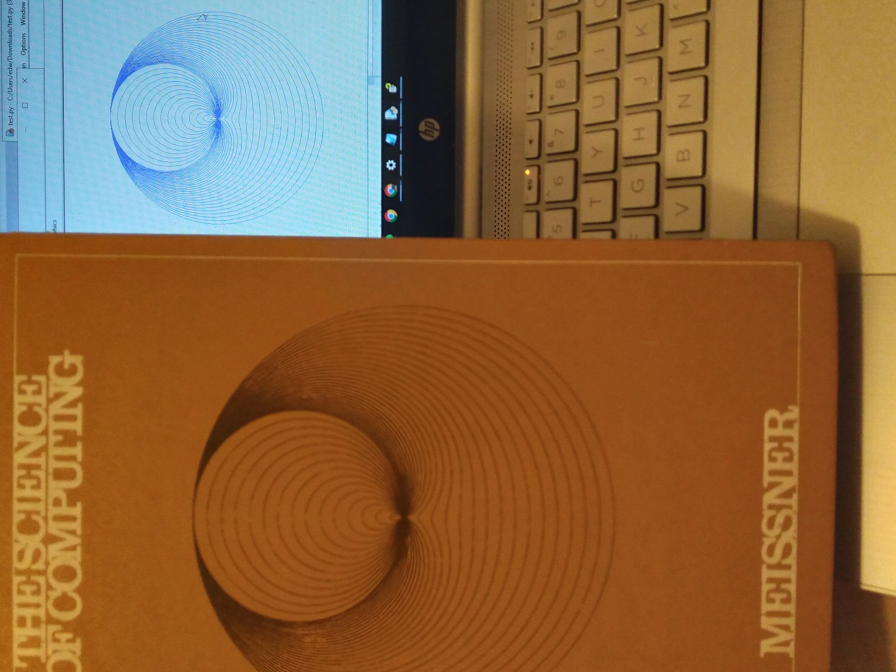

# Limaçons

[Limaçons](https://wikipedia.org/wiki/Lima%C3%A7on) are a family of parametric curves which can be expressed in polar form.
I wrote a Python program using the `turtle` library and trigonometric functions which plots 30 limaçons.

My intention was to replicate the cover image of the 1974 introductory computing textbook 'The Science of Computing' by Loren P. Meissner. Reading through the book, I found it astonishing how far computers have advanced in both software and hardware since the late twentieth century (no more tape drives and mainframes!). However, there are some fundamental aspects of computing which have remained unchanged, namely, the mathematical and algorithmic foundations of Computer Science. I believe there is a certain beauty showcased by that sense of timelessness.

---

Source code available: [here](https://gist.github.com/edward70/2a3997c3c8fe8ec5c98e5277f5503760).