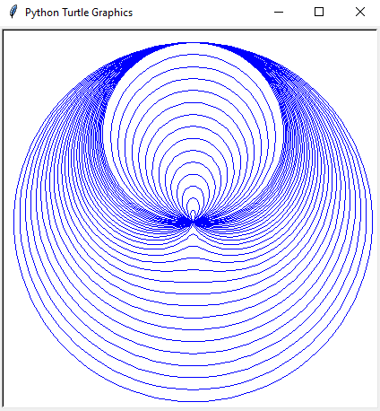

# Limaçons

Limaçons are a family of parametric curves which can be expressed in polar form.
I wrote a Python program using the `turtle` library and trigonometric functions which graphs 30 limaçons.

---

Source code available: [here](https://gist.github.com/edward70/2a3997c3c8fe8ec5c98e5277f5503760).