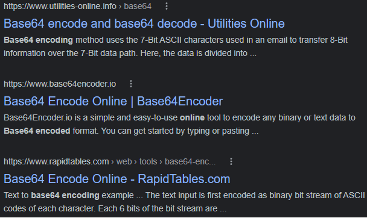

# Online Tools

I think it's a common experience for anyone who has regularly used the internet to stumble across the various online conversion and tools websites for tasks like Base64 encoding or PDF file splitting. 

They tend to perform routine tasks which are simple but are done infrequent enough that it's too bothersome to install a dedicated program for them. While the websites are generally quite helpful and convenient, it's difficult to believe that the operators of these websites run them for free out of the kindness of their hearts (especially given the shady, fly-by-night feel these businesses have). What concerns me is that often times, users may use these sites to process sensitive information or documents unaware of possible risks. These sites will often send submitted data to a backend API where it may be retained for who knows how long and used for who knows what.

As such, I decided to create my own Online Tools website which performs a variety of common tasks on textual data entirely client-side using JavaScript in the user's web browser. This elimates possible concerns of user submitted data being retained by an untrustworthy third-party. Furthermore, all code for the site is open source on [GitHub](https://github.com/edward70/online-tools) to be freely inspected and audited by others.

I created this website using a custom made theme for the Jekyll static site generator, then added JavaScript code to process user tasks completely client-side. All the code was then hosted on GitHub pages for easy access.

---

Live demo available: [here](https://edward70.github.io/online-tools/).
Source code available: [here](https://github.com/edward70/online-tools).